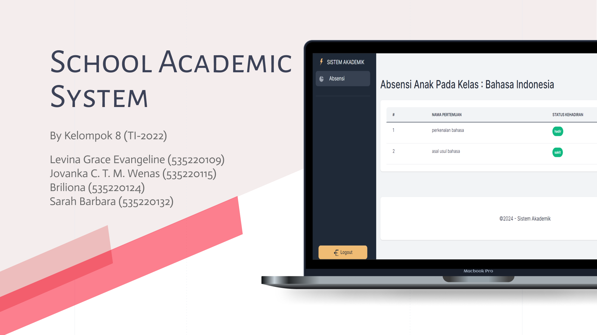

# SchoolAcademicSystem

  
School Academic System ini dibuat untuk menyederhanakan pengelolaan data siswa, guru, dan orang tua, serta manajemen kehadiran siswa. Admin memiliki kontrol penuh atas pengelolaan, termasuk pendaftaran guru dan pengaturan kelas dan mata pelajaran sebelum menambahkan data siswa. Guru dapat dengan mudah mengelola kehadiran siswa, sementara orang tua dapat mengakses profil dan laporan kehadiran anak-anak mereka. Dengan antarmuka yang bersih dan sederhana, serta penggunaan Bootstrap untuk pengalaman pengguna yang lebih baik, sistem ini menjadi solusi yang efektif untuk kebutuhan manajemen sekolah.

## Anggota Pengembang 
Mahasiswa FTI Universitas Tarumanagara
(NAMA                               NIM    Github Account):
- Levina Grace Evangeline 	    535220109   (Vinagrce)
- Jovanka C. T. M. Wenas	 	535220115   (jovanka633)
- Briliona			            535220124   (Yona1201)
- Sarah Barbara			        535220132   (saraah97)
 

## Steps
- Download zip dan extract
- ganti .env
- composer install
- php artisan migrate --seed
- php artisan serve
  
